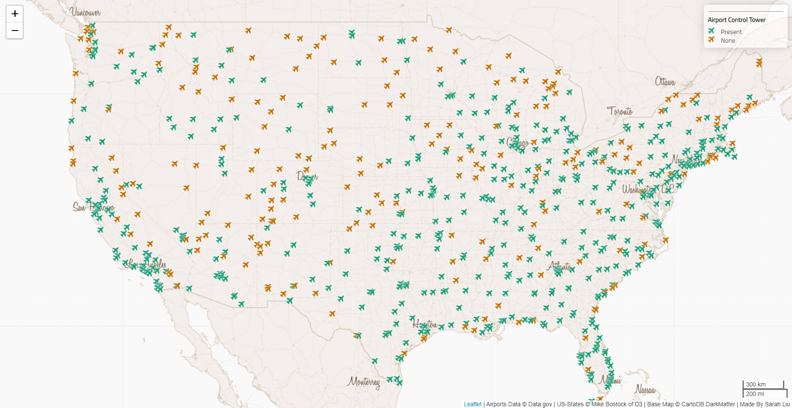

<h1> &#9992; Airports Across America &#9992; </h1>

<h3>Introduction</h3>

In the `airports.geojson` file there is a field `CNTL_TWR` which indicates if the airport has an air traffic control tower present.

This map displays all the airports in the contiguous United States of America in 2012.

<h3>Libraries</h3>
&#9992; Basemap: https://leaflet-extras.github.io/leaflet-providers/preview/  
&#9992; Font: https://fonts.google.com/  
&#9992; Icon: https://fontawesome.com/

<h3> Data Sources </h3>

&#9992; `airports.geojson` <https://catalog.data.gov/dataset/usgs-small-scale-dataset-airports-of-the-united-states-201207-shapefile>

&#9992; `us-states.geojson`
[Mike Bostock](http://bost.ocks.org/mike) of [D3](http://d3js.org/)
