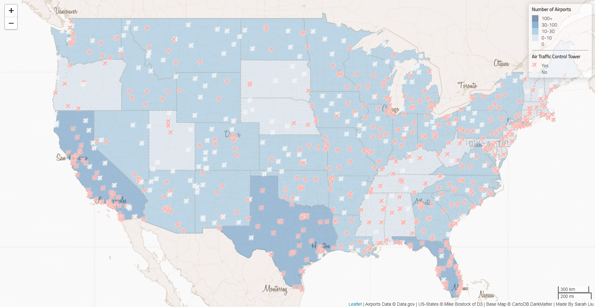

<h1> &#9992; Airports Across America &#9992; </h1>

<h3>Introduction</h3>

In the `airports.geojson` file there is a field `CNTL_TWR` which indicates if the airport has an air traffic control tower present. It is useful when wanting to do airport communications or air control. 

This map displays all the airports in the contiguous United States of America in 2012.

<!---
I reallllllly wanted to embed the map here :(((((
It would have been cool to move the map around in this read.me file

--->

<h3> Functions </h3>
&#9992; Shows locations of airport towers  
&#9992; Choropleth map shows the general freqencies of where airport towers are located at  
&#9992; Popups show the Airport Names  

<h3>Libraries</h3>
&#9992; Basemap: https://leaflet-extras.github.io/leaflet-providers/preview/  
&#9992; Font: https://fonts.google.com/  
&#9992; Icon: https://fontawesome.com/

<h3> Data Sources </h3>

&#9992; `airports.geojson`  
<https://catalog.data.gov/dataset/usgs-small-scale-dataset-airports-of-the-united-states-201207-shapefile>

&#9992; `us-states.geojson`  
[Mike Bostock](http://bost.ocks.org/mike) of [D3](http://d3js.org/)
